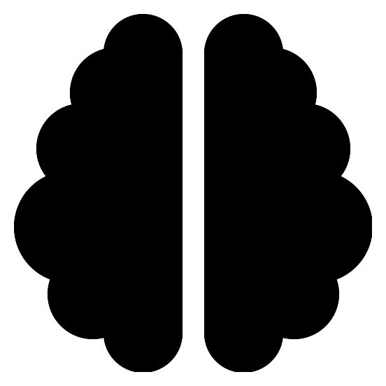

# NOTE: This is the anonymized version of another repository. It is intended for demonstration purposes only.

# anonymized-tokenizer

Train, evaluate and analyze BPE tokenizers.

<a href='https://github.com/abcde17/anonymized-tokenizer/actions/workflows/python-package.yml'></a>
<a href='https://coveralls.io/github/abcde17/anonymized-tokenizer?branch=development'></a>
<a href="https://github.com/psf/black"></a>

## Resources

* source code: [https://github.com/abcde17/anonymized-tokenizer](https://github.com/abcde17/anonymized-tokenizer)
* documentation: [https://abcde17.github.io/anonymized-tokenizer](https://abcde17.github.io/anonymized-tokenizer)

## Installation

``` bash
git clone https://github.com/abcde17/anonymized-tokenizer.git
pip install -r requirements.txt
```

-----------
## About

This repository provides easy-to-use tools to sample (weighted) data and subsequently train, evaluate and analyze a tokenizer.

<div align="center">
&nbsp;
&nbsp;
&nbsp;
&nbsp;
&nbsp;
&nbsp;
&nbsp;
&nbsp;
&nbsp;
&nbsp;
&nbsp;
&nbsp;
&nbsp;
</div>
<div align="center">
<div align="center">
Sampling &nbsp;&nbsp;&nbsp;&nbsp;
Training &nbsp;&nbsp;&nbsp;
Evaluation &nbsp;&nbsp;
Analysis &nbsp;&nbsp;
</div>
&nbsp;
</div>

## Features

&nbsp;&nbsp;Sampling

- customizable amount of (disjoint) sampled data for training and evaluation
- weighting of different categories and languages

&nbsp;&nbsp;Training

- support for SentencePiece and HuggingFace
- customizable tokenizer features (vocabulary size, handling of whitespace and numbers, ..)

&nbsp;&nbsp;Evaluation

- computation of common tokenizer metrics (unknown rate, fertility, proportion of continued words, ..)

&nbsp;&nbsp;Analysis

- example tokenization
- vocabulary overlap and performance comparison across languages
- effect of the vocabulary size

-----------
